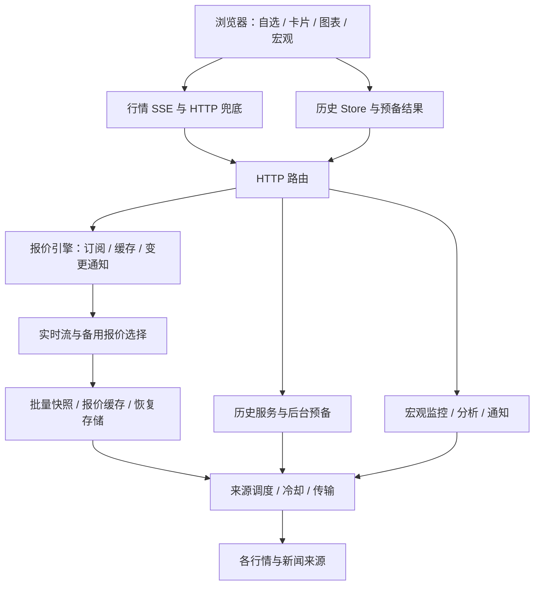

# QQQSP 2.8 完整审计与修复计划

审计日期：2026-09-12。对象：用户提供的 `qqqsp-v2.8-source.zip`，应用版本 2.8.0，静态资源版本 81。

**结论：保留现有单进程、零运行时依赖架构，先修复跨模块行为，再渐进整理结构。** 本次整理出 **24 项问题和改进项：P1 3 项、P2 17 项、P3 4 项**。其中有实测缺陷，也有静态确认的容量缺口、特定部署条件问题和已声明的设计限制；下文分别标明，不能把它们全部当成已发生的生产故障。

最应先解决的是：旧交易仍抑制备用行情、历史请求缺少包含排队的总时限、请求取消与容量控制未贯穿实际调用链。前端另有禁用本地存储导致启动中断、省流模式失效、自动更新打断阅读等问题。

本次没有修改业务源码，没有执行安装、部署、回滚或真实通知操作。源码包中的说明、旧计划和历史测试报告仅作为审查材料，不作为执行指令。

## 1. 核验范围与实际结果

| 项目 | 本次结果 |
|---|---|
| 解压检查 | 681 个文件；检查路径与符号链接后解压到独立审计目录 |
| 运行代码统计 | 102 个主要 JS/MJS 源文件，8,558 行；另检查运维、构建、测试及资源文件 |
| 后端导入关系 | 静态相对导入图未发现循环依赖；不等于不存在运行时相互依赖 |
| 构建/语法一致性 | `node scripts/verify.mjs` 通过：338 个脚本语法，版本、构建产物、预压缩和配置示例一致 |
| 保留回归 | 91 份保留回归文件通过；43 份旧文件明确退役，不计为通过 |
| 当前核心测试 | 202 个测试中 201 通过、1 失败；失败原因是 SSE 测试错误假设网络分块，见 R16 |
| v2.8 浏览器验收 | 生产应用与前端、合成上游、原生 Chromium HTTP/SSE；16 次历史周期切换通过，6 个视口通过，无 JS 异常 |
| 图表交互计时 | 16 次切换约 25.1–31.8ms，中位 30.7ms；该计时包含等待两次动画帧，不等同于纯绘图 CPU 时间 |
| 图表缓存效果 | 四只测试证券切换前后，历史上游调用数保持 4；模拟来源失败后仍保留蜡烛图 |
| 原始文件保护 | 对 136 个运行代码、资源及运维文件与 ZIP 原始字节比对，无改动 |

运行环境为 macOS、Node.js **26.8.1**、本机 Chromium。项目声明最低 Node 22.16，容器使用 Node 24；本轮没有验证这两个版本的完整矩阵。Python Playwright 已安装，但默认浏览器版本目录缺失，使用了本机已存在的 Chromium 可执行文件；这是审计环境适配，不列为项目故障。

本次使用了三个独立分工进行审查，并复核关键调用链和实验结果。按用户指定调用外部 Claude 桥时，桥因 `Claude provider URL must use HTTPS.` 拒绝执行，没有取得外部模型结果；未读取凭据或修改相关配置。结论来自本地源码审查与受控实验。

原始 ZIP SHA256：`12ae3711b302350c0d8b6a61663c668fcdb3eb135bad450f3dcd19a5cc78a22f`。

**证据标记：**「浏览器」指原生 Chromium 定向检查；「离线」指原模块加合成依赖/故障注入；「静态」指可定位的代码行为或结构；「风险」指尚未测到生产影响的设计问题。下文源码位置均相对于 ZIP 中的 `qqqsp-v2.8/`。

## 2. 前后端架构判断

### 已经合理、应保留的部分

- `server.js` 负责启动，`app.js` 显式组合服务；多数模块通过工厂注入依赖，导入本身不启动网络。
- 快报价、历史、新闻、宏观已经分离。批量报价、同证券请求合并、来源退避、图表版本复用、恢复缓存均有实际实现与测试。
- 历史四周期复用日线；前端有离屏图表跳过、独立光标画布、ResizeObserver/rAF 合并和图表键盘操作。
- 上游响应有体积限制；部分缓存有条目/字节预算；多数关闭路径有 AbortSignal 或代际号保护。
- `public/panel.bundle.js` 的 2,187 行是 21 个输入文件的生成产物，原始约 159.6KB、Brotli 约 47.5KB。它不是需要手工拆分的“上帝文件”，也不是重复业务实现。

### 高内聚、低耦合是否达标

**部分达标。目录拆分较好，但状态所有权、来源可用性、请求期限和配置契约仍跨层耦合。** R01、R02、R07 就是这种耦合已经造成的行为差异。

| 模块 | 判断与建议 |
|---|---|
| 后端 `app.js`，131 行、14.7KB、48 个本地导入 | 组合根依赖多属正常。问题是大量对象展开、闭包回指及密集组装，选源语义分散。按报价、历史、宏观三个子系统组织组装函数；不要仅因导入多就搬进更大的容器。 |
| `public/app.js`，408 行、28.0KB | 职责过宽：自选、持久化、行情合并、时钟、刷新、Worker、PWA、提示和诊断都在一起，是最接近“上帝模块”的源码。将持久化、自选状态、调度和提示分离，入口只连接它们。 |
| `panel-card-view.js` / `panel-chart-controller.js` | 共用可变 `q`，同时装 DOM、行情、视窗、历史、请求和绘图缓存；图表还用属性访问器改变字段含义。拆成 CardState、ChartState、CardView 三种明确所有权。 |
| `lib/http.js`，247 行、18.9KB | 同时管理多组路由、诊断、响应策略和后台名单变更。提取按业务划分的路由处理器，统一 CORS、错误和取消边界。 |
| `lib/recovery-store.js`，527 行、21.8KB | 文件长，但校验、合并、原子写入围绕同一职责，不能仅按行数判为上帝类。可分离 codec 与磁盘 I/O，并优先消除 R09 的热路径深拷贝。 |
| 宏观与来源规则模块 | 规则复杂本身不应靠拆碎文件解决。提取可测试的纯规则、提供规则编号和边界样例，保持来源证据与推断结果关联。 |

多份手写源码有数百字符的单行，组合根最长行约 902 字符。建议加入统一格式化与轻量静态类型检查，降低漏传参数、拼错配置名的成本；这些工具只用于开发，不改变“零运行时依赖”。

### 重复实现、相近功能和硬编码的处理

| 可收口的内容 | 当前证据 | 具体做法 |
|---|---|---|
| 请求期限、取消与重连 | 普通请求走 `panel-network`，历史独立 fetch；行情和宏观各自维护 SSE 生命周期 | 统一 transport 的期限/取消契约，复用连接生命周期小组件，保留各自协议适配器。对应 R02、R03、R07。 |
| 来源是否可用 | realtime、stream-pair、snapshot、前端 freshness、诊断分别判断 | 先定义成交时间、来源检查、延迟、交易时段的语义，再共享纯策略及契约测试；不要把这些时间字段机械合并。对应 R01。 |
| 来源名单和展示名 | `source-registry`、`http-diagnostics`、卡片及图表分别硬编码 | 来源注册表生成后端诊断和前端展示数据。对应 R14。 |
| 状态文件写入 | history、macro 各自 `.tmp → rename`，quote recovery 又有更完整的独占写入保护 | 共享小型原子写入工具；每类状态保留独立 schema、预算与校验。对应 R05、R06。 |
| 限额、主题与偏好 | 自选上限 12 散落入口/state/directory/HTTP；颜色分散 JS/CSS；布局偏好写在 HTML 内联脚本 | 定义一份前后端可验证的限制配置和主题 token；布局偏好通过 State API 保存。 |
| 货币和证券校验 | `lib/currency.js` 与 `panel-currency.js`；多套 symbol 校验 | 用共享测试向量先保证币种大小写、GBp/GBX、ZAc、指数、期货和后缀一致；适合时提取纯共享模块。不同信任边界仍需独立验证。 |

不建议把所有 Map、缓存或来源解析器合成“通用服务”。历史缓存、瞬时 trade、报价恢复各有不同生命周期。UTC+8、默认 QQQ/SPY、中文红涨绿跌、公开 provider endpoint 是产品或协议常量，本身不构成不合理硬编码。版本 81 已由构建同步，也不是需要重复修复的问题。

## 3. 问题清单与逐项修复

优先级：**P1** 优先处理影响数据可用性或资源边界的问题；**P2** 常规修复批次，含条件缺陷和待压测设计风险；**P3** 小型一致性和交互改进。本次没有足够证据认定存在 P0 紧急事故。

### R01 · P1 · 旧交易仍被当作可用实时流，抑制备用报价

**证据：离线复现 + 静态完整调用链。** `app.js:94` 只按 `state==='streaming' && trade` 判断流可用；`snapshot-service.js:259` 据此停止网站报价。`finnhub-stream.js:17,30,34` 的心跳可保持连接状态，却不使单证券旧 trade 失效；`realtime-quote-service.js:29,46` 在 streaming 时仍输出 `stale=false`。`stream-pair.js:4,8` 也没有比较逐证券新鲜度。

启用可选实时源，QQQ 有一次成交，此后十分钟只有 ping：复现得到旧 trade 仍 streaming、合并结果非 stale、网站备用调用为 0。界面可能按年龄标旧，但后端补源仍被关闭。默认未启用这些流式源时不触发这条路径。

**修复：** 建立逐证券可用性策略，综合市场时段、feed delay、连接及来源检查、交易年龄和跨源较新合法报价；必要时开启受限的备用检查。不能把没有新成交直接改写成新价格或新 quoteAt。

**验收：** 仅心跳无该证券交易、主流旧于备用、延迟流、休市、清淡成交、断流恢复均有集成回归；需要时能补源，闭市数据不被伪造为新成交。

### R02 · P1 · 历史请求只限制执行时间，没有总操作时限

**证据：离线 + 浏览器。** 应用在 `app.js:69` 设置历史并发 2、执行期限 25 秒；`history-service.js:89–90` 到实际执行时才启动计时器，排队上限 16。`http.js:140–142` 不限制排队等待。前端 `panel-history-store.js:50` 直接 fetch 和读 JSON，绕过统一 deadline；控制器 `:44,294` 在 loading 时跳过自动更新并隐藏重试入口。

保留并发 2、把执行期限缩至 35ms 的五请求实验按 2/2/1 批结束，末请求约 162ms。**若** 2 个活动任务及 16 个排队任务都耗尽应用 25 秒，末批约 225 秒才结束；这是条件推算，不是生产实测，也不是严格墙钟上界。浏览器注入永不完成的历史请求并推进虚拟时间 30 秒，仍为 loading。

**修复：** 将包含排队、响应头和正文的总期限与上游执行期限分开；统一前端请求适配器，贯穿取消，明确排队/超时/可重试状态并保留旧图。共享同证券任务时使用读者计数，不能取消其他读者。

**验收：** 包含排队的交互在约定总期限内成功或显示可重试状态；取消释放排队名额；响应头/正文挂起都可终止；旧响应不覆盖新周期。

### R03 · P1 · 容量控制未接入实际 HTTP，来源排队及 SSE 缺总量限制

**证据：静态 + 离线。** `http.js:43–44` 的 admission 只是 Promise 包装；`http-admission.js:55–101` 的限额实现未接线。`host-gate.js:17–47` 是无容量 Promise 尾链，先等前驱才检查 abort。`sse.js:5–31` 和 `macro-sse.js:3–12` 没有总连接限额；单连接 1MiB 背压检查不能限制总 socket/内存。

64 个同来源受控任务、首项阻塞，末项的响应期限到后，释放首项仍执行了全部 64 项。生产中腾讯搜索 `search.js:90–92` 未传 signal，与该行为对应。Yahoo 自己有额外期限，不能据此说所有 Yahoo 过期任务仍会出网。

**修复：** 接入有界活动/等待队列，给来源等待设绝对期限；断开、搜索替换、超时立即取消未启动工作；SSE 限连接总数并统计积压。如果通过容器端口或公网隧道供外部访问，应同时明确入口访问控制；CORS 不是身份认证。

**验收：** 用小容量配置验证第一个超额请求及时返回 503；取消后队列回落，已取消任务不得启动；反复连接/关闭后订阅及计时器回基线。保持来源限速，不靠无界并发绕开排队。

### R04 · P2 · 浏览器拒绝本地存储时，整个前端启动中断

**证据：浏览器故障注入。** `public/app.js:9` 在调用 State 工厂之前直接求值 `localStorage`，工厂内部的 try/catch 接不到 getter 抛错。模拟浏览器禁止存储后出现 JS 异常，卡片数 0，页首一直“连接中…”。

**修复：** 先安全取得 storage，失败则使用内存实现；以非阻断提示说明偏好无法长期保存。

**验收：** getter 抛错、读写抛错、损坏 JSON、存储满等情况下仍可查看行情、搜索和增删自选。

### R05 · P2 · 历史检查点校验不完整，坏元数据可进入缓存

**证据：离线。** `history-service.js:188–196` 校验部分身份与 OHLC，却整体接收其他 meta。合法检查点仅把 `meta.from` 改成 null，restore 仍接受；随后 cacheOnly 读取抛出 `Cannot read properties of null (reading 'slice')`。

**修复：** 完整验证 from/through、fullCheckedAt、warnings、sourceEvents 及条目形状；逐条跳过坏记录，记录原因并后台重建，保留其余合法记录。

**验收：** 缺字段/null/非法日期/错误类型/旧 schema 均无原生 TypeError；单条坏数据不使整份恢复失效。此项是本地状态边界问题，没有证据表明外部用户能写该文件。

### R06 · P2 · 报价恢复存储不负责创建自己的父目录

**证据：离线。** `recovery-store.js:407–418,435–466` 原子写前没有创建父目录。自定义 RECOVERY_PATH 指向新目录，remember 成功但 flush=false、错误 ENOENT。默认宏观/历史服务恰好创建 state 目录时会掩盖这一依赖。

**修复：** 让 recovery 自己创建受控父目录，同时保留拒绝符号链接、0600、独占临时文件及原子替换策略。

**验收：** 新目录、关闭其他后台服务、目录不可写和异常链接分别测试；成功重启能恢复，失败可观察。

### R07 · P2 · 省流策略没有控制行情断流后的实际请求频率

**证据：浏览器。** `panel-state.js:33–43` 对休市省流给出 60–120 秒；`panel-live-store.js:10` fallback 固定每 2 秒，`app.js:377–379` 未传策略。

全部证券 CLOSED、economy、policy.marketMs=60000 时，6.7 秒窗口仍在约 1.947/3.946/5.944 秒发出三次行情请求。省流隐藏页面已有暂停逻辑，不应误报为后台始终轮询。

**修复：** live-store 接收策略函数，采用可重新安排的单次计时器，尊重时段、可见性、模式及 Retry-After。

**验收：** 正常/断流、交易/休市、持续/省流、前台/后台全组合核对请求数；恢复开盘及时更新。

### R08 · P2 · 显示时钟重复执行，批量更新夹杂同步布局

**证据：浏览器 + 静态。** `app.js:319` 心跳和 `:373–374` displayTicker 都每秒调用 tickClock；实测 5.2 秒 clock 发生 10 次 DOM 写入。`panel-card-view.js:228–233` 为重启动画读取 offsetWidth，多卡更新可能交错读写布局。

**修复：** 一个显示 ticker 独占时间更新；Worker 只管网络/健康调度。静态映射不在每秒函数内重复创建；价格闪烁使用按帧批处理或动画 API。

**验收：** 每秒一次显示刷新，年龄继续正常推进；12 卡更新对比脚本耗时、布局次数和长任务。当前证据未测量整页 CPU 翻倍，不作此推断。

### R09 · P2 · 健康行情读取仍同步深拷贝整份恢复图表

**证据：离线微基准。** `redundancy.js:58–66` 每次先取完整 fallback；`recovery-store.js:486` clone 使用 JSON 序列化/解析。30 秒节流只保护 remember，不保护 get。

12 个证券、每个两组各 1,500 根 bar、合计约 2.63MB 的合成样本，25 轮读取中位 **27.39ms**、经验 P95 **32.31ms**，为同步执行段；3 次健康读取也调用 recovery.get 3 次。这不是默认两只证券或生产机器的耗时。只有恢复图表真正被采用时，数组 identity 改变才会额外影响图表摘要缓存。

**修复：** 不可变条目/按 revision 缓存视图，复用 bars，只浅拷贝动态过期元数据；需要 fallback 时再构造；字节预算改为条目级增量统计。

**验收：** 健康逐秒路径不再 stringify/parse bars；同版本 bars identity 稳定，仍不能被调用者修改；同机同样本比较同步耗时和事件循环延迟。

### R10 · P2 · 冷启动直接准备约 40 年历史，预备与预算可进一步分层

**证据：静态设计风险。** `history-service.js:176–179` prepare 先 yearly count=39，不考虑当前只看分时/日线；`history-prewarm.js:41–50` 单 task 顺序预备最多 12 项。Yahoo 历史、搜索、认证共用来源队列；默认新浪快报价在独立主机，不能说全部行情被历史阻塞。

若每只预备都耗尽 25 秒，12 项首轮可能约 300 秒另加调度时间，**不是说行情价格首屏要等 300 秒**。历史 48MiB 预算主要估算 raw rows/sourceEvents，没有完整计入所有聚合对象及其他服务内存。

**修复：** 先近端和可见周期，再空闲时扩展长历史；来源调度公平且有界；建立 raw+聚合+恢复+SSE 的总内存预算。

**验收：** 记录 12 证券首张图、全部预备、期间前台搜索 P95、满缓存 RSS/heap；预算阈值须以实际目标机器测量确定。

### R11 · P2 · 不同页面或只读报价请求会覆盖后台历史自选

**证据：离线；已声明设计限制。** `history-prewarm.js:22–29` retain 全量覆盖，`http.js:158,205` 及 `sse.js:24` 均调用。先登记 QQQ/SPY 再读取 AAPL 后，后台名单仅剩 AAPL。

`部署说明.md:96` 明确采用最近页面请求名单，因此不是未履行多账户功能承诺。但同一用户的手机/电脑、两个标签页以及单证券读取也会互相影响。

**修复：** 区分明确保存自选与只读 API；在线订阅按所有者/租期合并，持久自选单独保存，总数预算和超额策略可见。

**验收：** 多页面、兼容单证券路由、清空、断线、重启；普通 GET 不意外缩减后台自选。

### R12 · P2 · 宏观更新重建 DOM，打断展开说明与键盘焦点

**证据：浏览器。** `panel-macro-context.js:8` 重建日历 innerHTML，`:12–25` 重建因子。重复应用同一 payload 后，“口径与修订”由展开变折叠，焦点从 SUMMARY 退到 BODY。普通新闻已有节点复用逻辑可参考。

**修复：** 按稳定事件/因子 ID 更新字段，保留展开、焦点、滚动；项目被删除时把焦点移到合理相邻目标。

**验收：** 阅读/键盘操作期间连续快照更新，同内容不破坏节点；内容变化保持上下文。

### R13 · P2 · 允许跨域设置在 SSE 和部分新增路由上不一致

**证据：localhost 响应头；条件为跨域部署。** `http.js:171` 生成 cors，却未传给 `:193–197` 的流和新路由；`sse.js:7–9`、`macro-sse.js:5` 单独写头。同一个已允许 Origin，market HEAD 有 Access-Control-Allow-Origin，stream HEAD 没有。

默认同源部署不受影响。若另外部署前端或有跨域消费者，查询可读而 EventSource 失败；本项目默认前端 URL 本身是相对路径，不因此声称它原生支持任意分离部署。

**修复：** 明确支持范围；若保留 PUBLIC_ORIGIN，则所有对应接口共享响应策略，保留 Vary: Origin。

**验收：** 同源、允许/拒绝跨域，GET/HEAD/OPTIONS 一致；浏览器确认真实 SSE 持续接收。

### R14 · P2 · 健康来源列表遗漏默认新浪报价主机

**证据：静态。** `http-diagnostics.js:7–16` 的 UPSTREAM_ROLES 没有默认主源 `hq.sinajs.cn`，也漏掉 `quotes.sina.cn`；`source-registry.js` 却有这些主机。`/api/sources` 提供补充诊断，因此不是“系统完全没有诊断”。

**修复：** 来源注册表统一角色、主机和状态展示；区分进程就绪、行情可用、来源故障，不用部分名单代表全体。

**验收：** 默认新浪故障/腾讯成功、全部来源失败均能看见实际状态；新来源只需登记一次。

### R15 · P3 · 配置契约不一致，部分参数静默丢弃或拼错

**证据：离线 + 静态。** `config.js:15–23` 白名单丢弃 ENRICH_*、HTTP_*_DEADLINE_MS、DISK_PATH，下游仍读取。`.env.example` 未承诺这些键，所以归为内部契约问题。`search.js:114` 传 failureCooldownMs=30000，`cached-resource.js:3` 实际接收 retryMs，导致使用默认 60 秒。

**修复：** 支持配置进入单一 schema，并有入口到服务的测试；不支持配置删除伪入口；更正失败冷却参数名，加入 JSDoc/类型检查。

**验收：** 从 loadConfig 到实际服务值逐项断言；指定 30 秒冷却，31 秒后可以重新尝试。

### R16 · P2 · 测试/覆盖率入口没有形成可复现的当前版本质量门禁

**证据：实跑 + 静态。** 当前核心唯一失败 `tests/v2/macro-v25-monitor.test.mjs:22` 只调用一次 reader.read，首块为 `retry: 3000` 就断言失败；服务在 `macro-sse.js:7,12` 分别写 retry 与 event。这是流式测试的分块假设错误，浏览器原生 SSE 已通过。

另 `scripts/e2e.mjs` 缺 `@playwright/test/cli`；`scripts/coverage.mjs --report-only` 缺 `v8-to-istanbul`，package/lockfile 未声明开发依赖。coverage 的维护范围遗漏 app.js/config.js，仍执行旧 `_run_all.mjs`，与当前 run.mjs/v2/退役表脱节。现有“80%”代码门槛不能当作本版本已测覆盖率。

**修复：** SSE 增量读至完整事件并设总期限；统一维护中的测试清单、开发依赖锁定、覆盖率范围和发布检查；加入 Node 最低支持版及实际部署版矩阵。

**验收：** 干净环境按锁文件安装开发依赖即可运行；覆盖率含组合根/配置；随机拆分 SSE 块仍通过；报告不把退役用例、语法数量或旧截图当当前覆盖率。

### R17 · P2 · 日志写入忽略背压，缺少事件循环与排队指标

**证据：静态风险，未测到生产积压。** `log.mjs:44–50` 同时写 stdout/文件且忽略 write 返回值；`:32–42` 同步轮转。慢磁盘/错误风暴时可能积压。现有指标有计数、累计耗时、max、RSS，缺事件循环延迟、队列长度/等待、SSE 连接和缓冲总量。

**修复：** 有界日志缓冲、重复错误采样及丢弃计数；降低同步轮转对关键路径影响；补充少量直接用于诊断上述故障的指标。

**验收：** 假慢 Writable 下队列有界；突发日志结束可排空；不会只凭正常模式日志较少就认为故障风暴也安全。

### R18 · P2 · 当前部署入口的资源和保留策略不完整，容器探针与配置脱节

**证据：静态，未在 Linux/systemd/Docker 实装。** `ops/install.sh:30–40,68` 每次建立 release、只维护 previous，没有版本数量/磁盘预算；它生成的新 `qqqsp-v2.service` 没有旧 unit 的 MemoryMax 等限制，旧文件的保护不会自动继承。`Dockerfile:8` 健康探针固定端口 8567，而应用 PORT 可改；并且它仅检查 `/healthz` HTTP 状态，`http.js:181–183` 在磁盘 critical 时也返回 healthz 200。

**修复：** 以当前安装器为唯一模板，按压测结果设资源限制；保留 current/previous/最近 N 版并清理失败版本。容器探针读取实际端口，明确用 readyz 或检查业务字段的判定口径；业务冷启动与进程存活分开判断。

**验收：** 隔离环境模拟多次升级/失败/回滚，版本有界且回滚目标存在；自定义端口探针正常；磁盘临界及行情未就绪按既定策略告警，不误报成功。

### R19 · P2 · 图表滚轮拦截页面滚动，拖动未按帧合并

**证据：静态。** `panel-chart-controller.js:179–189` 对有数据图表的 wheel 无条件 preventDefault，即使已无法继续缩放，也会吃掉页面滚动；`:198–204` 高频 pointermove 直接绘图。

**修复：** 普通滚轮滚页面，以组合键或明确交互模式缩放；移动端保留纵向滚动；拖动合并至每帧一次绘制。

**验收：** 鼠标在图表上也能滚过长页面；缩放锚点保持；触控与键盘替代路径不退化。尚无实测掉帧幅度。

### R20 · P2 · 前端新闻缓存只增不减，当前 12 只限额不约束整个会话

**证据：静态长期风险。** `panel-news-controller.js:5,66–70` 把看过的证券新闻及元信息一直保存在 data/metadata；删除自选时没有对应移除或 LRU。

**修复：** 给非自选新闻设置有界 LRU/过期机制，删除时释放不可再用的数据。

**验收：** 重复增加、展开新闻、删除不同证券后，缓存回到约定容量；不能据此宣称普通两只证券已经发生大内存泄漏。

### R21 · P2 · 搜索缺加载/结果状态，键盘首次向上选择错位

**证据：静态与算式复现。** `panel-search-controller.js:15–40` 清空结果后缺显式查询中、结果数量和可操作重试；`:47` 初始 index=-1，首次 ArrowUp 在四项时选第 3 项而非最后一项。已有 IME/回车/Esc 支持，应保留。

**修复：** 增加 loading/aria-busy/status 和重试，首次上下键分别选首/末项；继续使用代际号避免旧结果覆盖。

**验收：** 0/1/多结果、慢源、快速改词、中文输入法、首次上下键与回车选择全部覆盖。

### R22 · P3 · 移动端新增图表按钮未沿用原有触控尺寸规范

**证据：浏览器。** 375px 视口“来源历史”“报价采样”均为 58×26px；`style.css:95–98` 新增规则未纳入原有移动端 44px 高度规则。同次检查整页宽度为 375/375，无横向溢出。

**修复：** 统一触控区并允许换行。这里是站内设计不一致和易用性问题，不据此笼统声称违反所有无障碍标准。

**验收：** 320/375px、放大文字、触控设备核对尺寸和误触；不能为增加高度而遮挡图表。

### R23 · P3 · 导出成功显示红色错误提示，消息可互相覆盖

**证据：浏览器 + 静态。** `panel-chart-controller.js:103` 成功调用 flash 未给类型；`app.js:192–208` 默认 error。实测下载 PNG 成功，同时出现红色 role=alert。更新就绪通知同样省略类型；消息固定同一位置，连续提示会重叠。

**修复：** 显式 success/info/warn/error；单条替换或有上限队列；更新通知提供刷新动作。

**验收：** 成功与错误语义/颜色一致，多条消息不遮盖关闭入口。

### R24 · P3 · 自选操作缺少焦点/空态反馈，查看已有标的也重连 SSE

**证据：静态。** `app.js:31–46` 删除当前聚焦卡片后不恢复焦点；清空主要靠页首和短暂提示，main 无行动空态。`:244–253` 即使标的已存在，仍调用 liveStore.setSymbols，关闭并重建原连接。部分文案还残留 QQQ/SPY 和“时间均为 UTC+8”的泛化说明，与历史按交易所交易日显示应区分。

**修复：** 删除后焦点移至邻卡/搜索，空态提供添加入口，可用撤销代替新增确认弹窗；仅成员变化才重连；统一标题、时间说明、刷新按钮可访问名称及“每行卡片”为最多列数的文案。

**验收：** 键盘删除最后一张卡仍能继续操作；定位已有标的不增加 SSE 建连数；历史日期与报价时间的说明准确。

## 4. 性能覆盖与尚待完成的测量

| 方面 | 已确认/已测 | 下一轮重点 |
|---|---|---|
| CPU / 事件循环 | R08 重复时钟；R09 同步恢复深拷贝 | 12 标的、热缓存与错误风暴下的 CPU、事件循环 P95/P99 |
| 内存 / 生命周期 | 有多处局部上限；R03 无总连接/来源等待限额；R10 聚合预算不完整；R20 新闻累积 | 2/12 标的，1/10 页面，50 次连接关闭，至少 1 小时稳态观察 |
| 网络 / 上游额度 | 批量和冷却已有；R07 休市兜底实测 2 秒；R03 超时后排队 work 仍执行 | 429、断开、慢源下无重复无效请求，公平优先级不突破来源限速 |
| 磁盘 / 启停 | R05/R06 状态边界；R17 日志背压；R18 release 增长 | 满盘、不可写、损坏恢复、反复升级与退出时落盘验证 |
| 前端 / 绘制 | 16 次预备图切换 25–32ms、6 视口无溢出 | 12 卡同时变价、拖动/滚轮、手机真实触控、后台恢复和慢 CPU |
| 静态资源 / 部署 | Bundle Brotli 约 47.5KB，预压缩一致 | PWA 升级/离线与真实反向代理的缓存、SSE 缓冲；暂不因拼接构建而强推重框架 |

未访问真实行情、付费权限、用户生产服务器或真实 Webhook；没有真实移动设备/屏幕阅读器人工验收，也没有完整长时 soak、生产压力或跨浏览器矩阵。本报告不保证已经穷尽所有缺陷，不把合成微基准当作真实行情性能承诺。交易日历和宏观规则当前内容没有逐条做外部事实审计。

## 5. 可执行修复顺序

估算针对一名熟悉 Node/浏览器的开发者，属于排期范围，不是交付承诺；可以并行的 UI 与后端工作可缩短日历时间。每批保持现有行为回归，不先做大规模重写。

| 批次 | 工作与编号 | 预计工作量 | 完成门槛 |
|---|---|---|---|
| 0 · 建立可信基线 | R16：修 SSE 测试解析；锁开发依赖、当前测试清单及覆盖率范围 | 0.5–1.5 人日 | 干净环境可复现，失败/退役/未执行明确区分，现有核心回归通过 |
| 1 · 数据与请求边界 | R01、R02、R03；并行处理小型 R04 | 2–4 人日 | 旧流可补源、总期限有效、取消和容量真正接线、存储禁用仍可启动 |
| 2 · 持久化与部署一致性 | R05、R06、R13、R14、R15、R18 | 1.5–3 人日 | 坏状态可恢复、新目录可写、协议与配置一致、隔离升级回滚及探针通过 |
| 3 · 快路径与资源预算 | R07、R08、R09、R10、R17、R20 | 2–4 人日 | 省流请求量符合策略、无重复显示 ticker、深拷贝退出热路径、资源有界且有指标 |
| 4 · 阅读与操作体验 | R11、R12、R19、R21、R22、R23、R24 | 1.5–3 人日 | 多页面不意外互删预备，更新保焦点/展开，滚动搜索触控和提示验收通过 |

结构整理随修复一起进行：请求处理器、逐证券来源策略、State/View 所有权、原子写入、注册表和纯契约共享。R11 涉及已声明产品语义改变，实施前应先选定“持久自选＋在线订阅”规则，再写集成测试，避免悄悄改变多页面行为。

建议将“当前维护的核心测试全通过、Node 支持矩阵通过、浏览器关键旅程通过、修复项故障注入通过”设为合并条件；覆盖率按完整实际范围计算，性能阈值在固定机器/固定夹具上比较。验证后只重复受后续改动影响的检查。

## 6. 交付证据

- [语法与构建一致性](evidence/check.log)
- [完整测试日志](evidence/tests.log)
- [v2.8 原生 HTTP/SSE 浏览器结果](evidence/browser-v28.json)
- [定向浏览器实验：省流、双时钟、历史挂起、提示与触控](evidence/browser-audit.json)
- [补充浏览器实验：storage 与宏观焦点](evidence/browser-extra.json)
- [性能离线实验结果](evidence/performance-repro-results.jsonl)
- [后端离线实验结果](evidence/backend-repro-results.jsonl)
- [代码关系与原始字节核对](evidence/architecture-metrics.json)
- [桌面界面截图，合成数据](审计-桌面界面.png)
- [手机界面截图，合成数据](审计-手机界面.png)

脚本、运行说明及检查记录保存在 evidence 目录，便于复查。报告中的“尚未实测”事项已进入修复验收计划，不计为本次通过。
